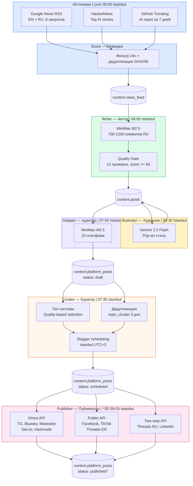
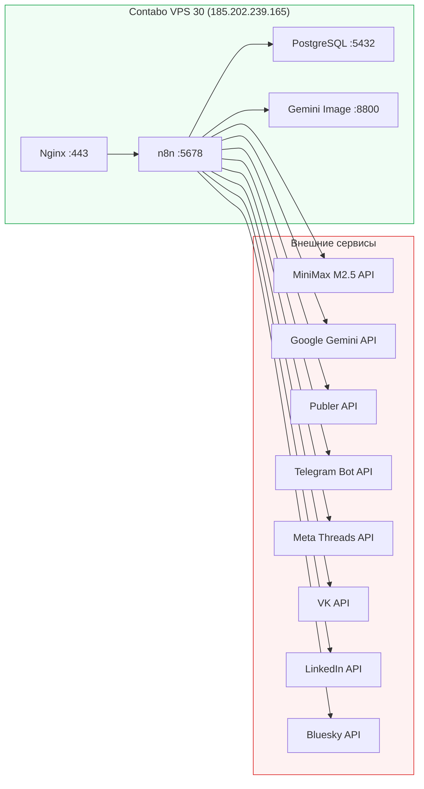

# Архитектура Content Pipeline v2

## Data Flow



## Инфраструктура



## Время работы (Istanbul UTC+3, ежедневно)

> Все cron-ы задаются в UTC на сервере. Ниже — Istanbul (UTC+3) для удобства.

| Время (Istanbul) | Workflow | Что делает |
|-----------------|----------|------------|
| 05:00 | Scout | Сбор новостей из RSS, HN, GitHub |
| 06:00 | Writer | Генерация 5 постов из лучших новостей |
| 06:30 | Illustrator | Генерация картинок Gemini |
| 07:00 | Adapter | Адаптация 5 постов на 14 платформ |
| 07:30 | Curator | Распределение по расписанию |
| 09:00-00:00 | Publisher | Публикация каждые 30 мин по scheduled_at |

## Текущая модель статусов (Sprint 4A/4B/4C)

```
draft → scheduled → sending (atomic lock) → sent (API ok) → verified (read-back)
draft → scheduled → sending → failed (after 3 retry)
draft → skipped (пропущен Curator)
published = legacy статус от старого Publisher v2
```

> Подробнее: [[Database]], [[Publisher]]
