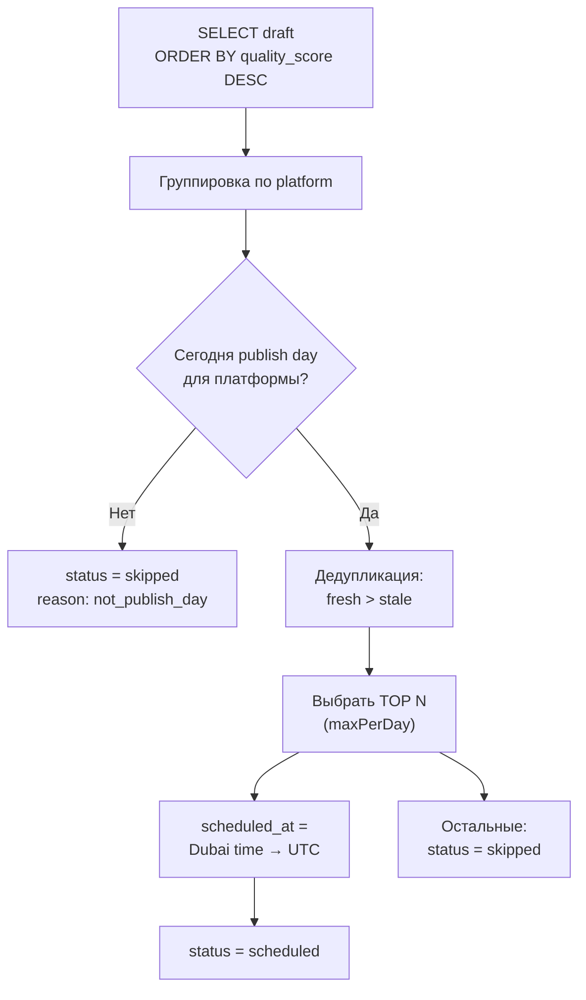

# Curator — Куратор

> Распределяет адаптированные посты по платформам с учётом Tier, расписания и дедупликации

## Назначение

Curator берёт ~50 записей `draft` из `content.platform_posts` и решает:
- **Какие** посты публиковать (quality-based selection)
- **Когда** (stagger scheduling, Istanbul UTC+3)
- **Где** (Tier-система + день недели)

## Конфигурация платформ

```javascript
PLATFORM_CONFIG = {
  telegram:   { maxPerDay: 2, publishDays: [ПН-ВС], times: ['09:00', '14:00'] },
  threads_ru: { maxPerDay: 5, publishDays: [ПН-ВС], times: ['10:00', '12:00', '14:00', '16:00', '18:00'] },
  linkedin:   { maxPerDay: 1, publishDays: [ПН,СР,ПТ], times: ['10:00'] },
  bluesky:    { maxPerDay: 3, publishDays: [ПН-ВС], times: ['11:00', '15:00', '19:00'] },
  threads_en: { maxPerDay: 5, publishDays: [ПН-ВС], times: ['10:00', '12:00', '14:00', '16:00', '18:00'] },
  mastodon:   { maxPerDay: 1, publishDays: [ПН-ВС], times: ['19:00'] },
  vk:         { maxPerDay: 1, publishDays: [ПН,СР,ПТ], times: ['16:00'] },
  facebook:   { maxPerDay: 1, publishDays: [ПН,СР,ПТ], times: ['16:00'] },
  devto:      { maxPerDay: 1, publishDays: [ПН],        times: ['19:15'] },
  hashnode:   { maxPerDay: 1, publishDays: [ПН],        times: ['19:30'] }
}
```

## Алгоритм



## Дедупликация

Для каждого поста проверяется: был ли пост с таким же `topic_cluster` опубликован на этой платформе за последние 3 дня.

- **fresh** (recent_same_cluster = 0) — приоритет
- **stale** (recent_same_cluster > 0) — fallback, если fresh не хватает

## Dry-run Preview

**URL:** `GET https://n8n.timzinin.com/webhook/curator-preview`

Возвращает JSON с планом распределения БЕЗ изменения БД:
```json
{
  "mode": "PREVIEW (no changes applied)",
  "date": "2026-03-22",
  "day": "Sat",
  "scheduled_count": 14,
  "skipped_count": 26,
  "scheduled": [...],
  "skipped": [...]
}
```

## Типичное распределение

| День | Платформы | Постов |
|------|-----------|--------|
| ПН | Все 10 платформ | 21 |
| ВТ | TG, Threads, Bluesky, Mastodon | 16 |
| СР | TG, Threads, Bluesky, Mastodon, LI, VK, FB | 19 |
| ЧТ | TG, Threads, Bluesky, Mastodon | 16 |
| ПТ | TG, Threads, Bluesky, Mastodon, LI, VK, FB | 19 |
| СБ | TG, Threads, Bluesky, Mastodon | 16 |
| ВС | TG, Threads, Bluesky, Mastodon | 16 |
