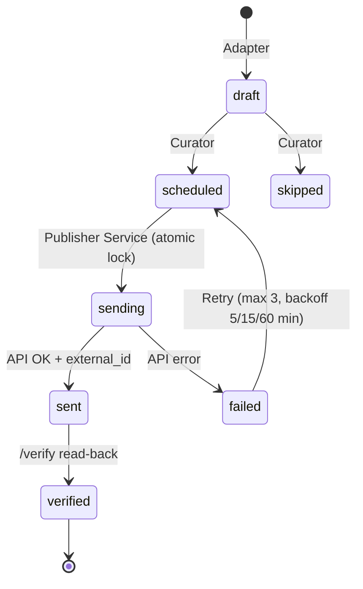

# База данных

> PostgreSQL, schema `content`, в n8n Docker Compose на Contabo VPS 30

## ER-диаграмма

```mermaid
erDiagram
    news_feed {
        serial id PK
        text title
        text url
        text source
        int score
        text title_hash UK
        boolean used
        text pub_date
        timestamptz fetched_at
    }
    posts {
        serial id PK
        int news_id FK
        text post_text
        int char_count
        text topic_cluster
        text category
        text hook_type
        int quality_score
        text quality_checks
        text image_url
        text image_source
        text status
        text post_type
        text product_url
        text product_name
        timestamptz created_at
    }
    platform_posts {
        serial id PK
        int post_id FK
        text platform
        text adapted_text
        int char_count
        text comment_text
        text reply_text
        text link_url
        text link_placement
        boolean include_image
        text image_url
        timestamptz scheduled_at
        timestamptz published_at
        text post_external_id
        text reply_external_id
        text status
        text error
        int retries
        timestamptz created_at
    }
    engagement {
        serial id PK
        int platform_post_id FK
        int views
        int likes
        int comments
        float engagement_rate
    }
    news_feed ||--o{ posts : "generates"
    posts ||--o{ platform_posts : "adapts to"
    platform_posts ||--o{ engagement : "tracks"
```

## Статусы

### content.posts
| Статус | Описание |
|--------|----------|
| draft | Создан Writer, ожидает адаптации |
| adapted | Адаптирован Adapter |

### content.platform_posts

**Текущая модель (Sprint 4A/4B):**

| Статус | Описание |
|--------|----------|
| draft | Создан Adapter, ожидает Curator |
| scheduled | Назначен Curator, ожидает Publisher |
| skipped | Пропущен Curator (не день публикации, лимит, дедупликация) |
| sending | Atomic lock: Publisher Service взял пост, публикация в процессе |
| sent | API платформы ответил OK, external_id записан |
| verified | /verify подтвердил наличие поста на платформе |
| failed | Ошибка после 3 retry, TG alert отправлен |
| published | Legacy: старый Publisher v2. Не используется v3 |

## Credentials

| Что | n8n Credential ID | Имя |
|-----|-------------------|-----|
| PostgreSQL | ZoqVLKcTqNQGoDI5 | Content Pipeline PG |
| MiniMax M2.5 | XuWX7OQvQ3kOGJRj | MiniMax API v2 |
