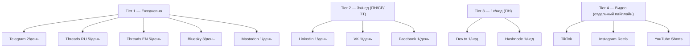
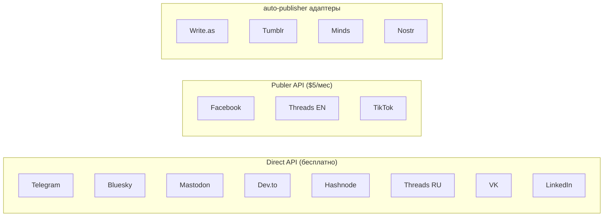

# Платформы

> Расписание, API, частота публикаций

## Tier-система

## Полная таблица

| # | Платформа | Язык | Частота | Метод | Current status (31 мар 2026) | Last publish |
|---|-----------|------|---------|-------|------------------------------|-------------|
| 1 | Telegram @timofeyzinin | RU | 2/день | Direct adapter | ✅ Currently verified | Mar 31 (msg_id=318) |
| 2 | Threads RU @timzinin | RU | 5/день | Direct adapter (2-step) | ✅ Currently verified | Mar 30 |
| 3 | Threads EN | EN | 5/день | Publer 2-step media | ⚠️ Recently verified | Mar 28 |
| 4 | LinkedIn | RU | 1/день ПН/СР/ПТ | Direct adapter | ⚠️ Recently verified | Mar 27 |
| 5 | Bluesky | EN | 3/день | Direct adapter (auto-resize) | ✅ Currently verified | Mar 30 |
| 6 | Mastodon | EN | 1/день | Direct adapter | ⚠️ Recently verified | Mar 29 |
| 7 | VK | RU | 1/день | Direct adapter (community) | ⚠️ Recently verified | Mar 28 |
| 8 | Facebook | RU | 1/день | Publer (personal profile) | ⚠️ Recently verified | Mar 28 |
| 9 | Dev.to | EN | 1/нед (ПН) | Direct adapter | ⏳ Historically worked | Mar 23 |
| 10 | Hashnode | EN | 1/нед (ПН) | Direct adapter (GraphQL) | ⏳ Historically worked | Mar 23 |
| 11 | Write.as | EN | 1/нед (ПН) | Direct adapter | ⏳ Historically worked | Manual test 22 Mar |
| 12 | Minds | EN | ПН/СР/ПТ | Direct adapter | ⏳ Historically worked | Manual test 22 Mar |
| 13 | Nostr | EN | ПН/СР/ПТ | Direct adapter | ⏳ Historically worked | Manual test 22 Mar |
| 14 | Tumblr | EN | ПН/СР/ПТ | — | ❌ Blocked (401 OAuth) | Never |

Legend: ✅ = published in last 2 days | ⚠️ = published in last 7 days | ⏳ = published >7 days ago | ❌ = blocked

## Не подключены (бэклог)

| Платформа | Язык | Статус |
|-----------|------|--------|
| Twitter/X | EN | Отложен |
| Medium | EN | Нет API |
| VC.ru | RU | Нет адаптера |

## Методы публикации

## Source of Truth для стратегий

GitHub: https://github.com/TimmyZinin/smm-research-hub
Файлы: `smm_audits/md/s00-s34`

| Файл | Платформа |
|------|-----------|
| s00_global_strategy.md | Мастер-стратегия |
| s01_linkedin.md | LinkedIn |
| s04_telegram_personal.md | Telegram |
| s06_threads.md | Threads |
| s07_facebook.md | Facebook |
| s09_vk.md | VK |
| s11_devto.md | Dev.to |
| s13_hashnode.md | Hashnode |
| s14_bluesky.md | Bluesky |
| s15_mastodon.md | Mastodon |
| s33_publer_integration.md | Publer |
