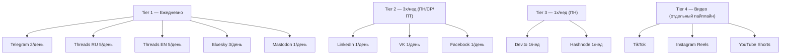
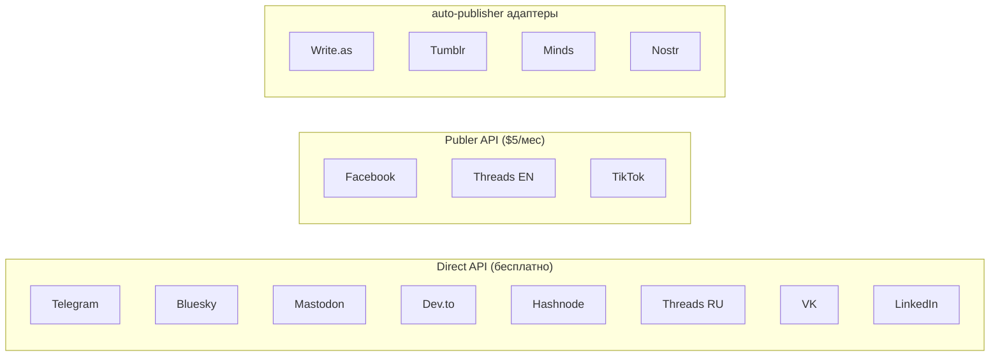

# Платформы

> Расписание, API, частота публикаций

## Tier-система

## Полная таблица

| # | Платформа | Язык | Частота | Время (Istanbul UTC+3) | Метод | Publisher v3 статус |
|---|-----------|------|---------|---------------|-------|----------------|
| 1 | Telegram @timofeyzinin | RU | 2/день | 09:00, 14:00 | Direct adapter | ✅ Verified (Tim external) |
| 2 | Threads RU @timzinin | RU | 5/день | 10-18:00 | Direct adapter (2-step) | ✅ Verified (API) |
| 3 | Threads EN | EN | 5/день | 10-18:00 | Publer 2-step media | ✅ Verified (Tim external) |
| 4 | LinkedIn | RU | 1/день ПН/СР/ПТ | 10:00 | Direct adapter (linkedin.py) | ✅ В Publisher v3 |
| 5 | Bluesky | EN | 3/день | 11:00, 15:00, 19:00 | Direct adapter | ✅ Работает (auto-resize >950KB) |
| 6 | Mastodon | EN | 1/день | 19:00 | Direct adapter | ✅ Работает (токен обновлён Sprint 4D) |
| 7 | VK | RU | 1/день ПН/СР/ПТ | 16:00 | Direct adapter (community wall) | ✅ Verified (API + Tim external) |
| 8 | Facebook | RU | 1/день ПН/СР/ПТ | 16:00 | Publer 2-step media (personal) | ✅ Verified (Tim external) |
| 9 | Dev.to | EN | 1/нед (ПН) | 19:15 | Direct adapter | ✅ Verified (API) |
| 10 | Hashnode | EN | 1/нед (ПН) | 19:30 | Direct adapter (GraphQL) | ✅ Verified (API) |

## Подключены в Sprint 4C

| # | Платформа | Язык | Частота | Время (Istanbul) | Publisher v3 статус |
|---|-----------|------|---------|-----------------|---------------------|
| 11 | Write.as | EN | 1/нед (ПН) | 23:00 | ✅ Working (text verified) |
| 12 | Tumblr | EN | ПН/СР/ПТ | 23:15 | ❌ Blocked (401 Unauthorized — OAuth tokens expired) |
| 13 | Minds | EN | ПН/СР/ПТ | 23:15 | ✅ Working (text verified) |
| 14 | Nostr | EN | ПН/СР/ПТ | 23:30 | ✅ Working (text verified) |

## Не подключены (бэклог)

| Платформа | Язык | Статус |
|-----------|------|--------|
| Twitter/X | EN | Отложен |
| Medium | EN | Нет API |
| VC.ru | RU | Нет адаптера |

## Методы публикации

## Source of Truth для стратегий

GitHub: https://github.com/TimmyZinin/smm-research-hub
Файлы: `smm_audits/md/s00-s34`

| Файл | Платформа |
|------|-----------|
| s00_global_strategy.md | Мастер-стратегия |
| s01_linkedin.md | LinkedIn |
| s04_telegram_personal.md | Telegram |
| s06_threads.md | Threads |
| s07_facebook.md | Facebook |
| s09_vk.md | VK |
| s11_devto.md | Dev.to |
| s13_hashnode.md | Hashnode |
| s14_bluesky.md | Bluesky |
| s15_mastodon.md | Mastodon |
| s33_publer_integration.md | Publer |
