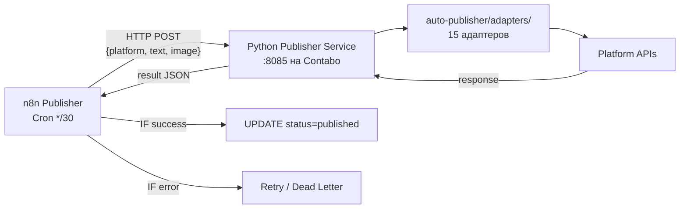

# Publisher — Публикатор

> Текущий статус и план рефакторинга

## Текущее состояние (v2)

**n8n ID:** 1cD3qXs2XZkgcQyt
**Cron:** */30 06:00-21:00 MSK
**SQL:** `WHERE status = 'scheduled' AND scheduled_at <= NOW() LIMIT 1`

### Верифицированные платформы

| Платформа | Статус | Проблема |
|-----------|--------|----------|
| Telegram | ✅ Работает | — |
| Dev.to | ✅ Работает | — |
| LinkedIn | ⚠️ Не верифицирован | ugcPosts API, нет проверки |
| Facebook | ⚠️ Не верифицирован | Publer state:"now" |
| Threads EN | ⚠️ Не верифицирован | Publer state:"now" |
| Threads RU | ⚠️ Двухшаговый | create проходит, publish не вызывается |
| VK | ⚠️ Формат | wall.post query params не создаёт пост |
| Bluesky | ⚠️ JSON bug | Апострофы в тексте ломают createRecord |
| Hashnode | ⚠️ Не проверен | GraphQL mutation |
| Mastodon | ❌ Блокер | Токен невалиден |

### Известные проблемы

1. **Токены захардкожены** в Code ноде — нужно в n8n Credentials
2. **UPDATE безусловный** — ставит `published` даже если API не ответил
3. **LIMIT 1** — 1 пост за 30 мин, нет loop
4. **Нет retry** — при ошибке пост теряется
5. **Двухшаговые API** (Threads RU, Bluesky) работают криво через If → 3 ноды одновременно

## План рефакторинга (Спринт 4)

### Целевая архитектура

### Почему Python сервис

- auto-publisher уже содержит 15 рабочих адаптеров (Python)
- n8n Code sandbox блокирует fetch/require — невозможно делать HTTP из Code нод
- Двухшаговые API (Threads create+publish, Bluesky auth+post) уже реализованы в Python
- Версионирование в git, а не в n8n UI

### Задачи Спринта 4

| # | Задача | Описание |
|---|--------|----------|
| PUB-1 | Python HTTP сервис | Flask/FastAPI wrapper над auto-publisher адаптерами |
| PUB-2 | n8n Publisher refactor | Одна HTTP Request нода → Python сервис |
| PUB-3 | Проверка API ответа | status=published ТОЛЬКО после success |
| PUB-4 | Retry с backoff | 3 попытки: 5/15/60 мин |
| PUB-5 | Dead letter | После 3 неудач → status=failed + TG alert |
| PUB-6 | Все 10 платформ | Через Python адаптеры |
| PUB-7 | Credentials в n8n | Вынести токены из Code нод |

### Существующие адаптеры (auto-publisher)

| Файл | Платформа | Статус |
|------|-----------|--------|
| adapters/telegram.py | Telegram | ✅ |
| adapters/threads.py | Threads | ✅ |
| adapters/vk.py | VK | ✅ |
| adapters/bluesky.py | Bluesky | ✅ |
| adapters/mastodon.py | Mastodon | ✅ |
| adapters/devto.py | Dev.to | ✅ |
| adapters/hashnode.py | Hashnode | ✅ |
| adapters/facebook.py | Facebook | ✅ |
| adapters/tumblr.py | Tumblr | ✅ |
| adapters/writeas.py | Write.as | ✅ |
| adapters/minds.py | Minds | ✅ |
| adapters/nostr.py | Nostr | ✅ |
| adapters/tiktok.py | TikTok | ✅ |
