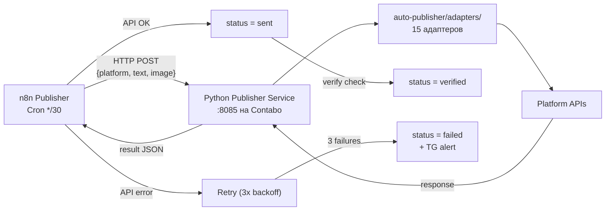

# Publisher — Публикатор

## Текущее состояние (v2) — до Sprint 4

**n8n ID:** 1cD3qXs2XZkgcQyt
**Cron:** */30 09:00-03:00 Istanbul (UTC+3)
**SQL:** `WHERE status = 'scheduled' AND scheduled_at <= NOW() LIMIT 1`

### Текущая модель статусов

```
scheduled → published (UPDATE без внешней проверки)
scheduled → failed (только при явной ошибке)
```

> **Проблема:** `published` в БД означает "UPDATE выполнен", а НЕ "пост реально на платформе". Observer и Dashboard показывают `published` как факт, хотя это не верифицировано.

### Верифицированные платформы (честный статус)

| Платформа | Publisher | Реально работает? |
|-----------|----------|------------------|
| Telegram | ✅ Отправляет | Да, проверено |
| Dev.to | ✅ Отправляет | Да, проверено |
| LinkedIn | ⚠️ Отправляет | Не верифицировано (ugcPosts API) |
| Facebook | ⚠️ Отправляет | Не верифицировано (Publer) |
| Threads EN | ⚠️ Отправляет | Не верифицировано (Publer) |
| Threads RU | ❌ Не работает | Двухшаговый API: create OK, publish не вызывается |
| VK | ❌ Не работает | wall.post формат запроса |
| Bluesky | ❌ Не работает | JSON bug (апострофы) |
| Hashnode | ❌ Не проверен | GraphQL mutation |
| Mastodon | ❌ Блокер | Токен невалиден |

### Известные проблемы текущего v2

1. **Токены захардкожены** в Code ноде
2. **UPDATE безусловный** — ставит `published` даже если API не ответил
3. **LIMIT 1** — 1 пост за 30 мин
4. **Нет retry** — при ошибке пост теряется
5. **Двухшаговые API** работают криво

---

## Sprint 4: Publisher Refactor (целевая архитектура)

### Новая модель статусов

```
scheduled → sent → verified (пост подтверждён на платформе)
scheduled → sent → failed (API error после retry)
scheduled → failed (невозможно отправить)
```

| Статус | Что означает |
|--------|-------------|
| scheduled | Curator назначил, ожидает Publisher |
| sent | Python сервис отправил, API ответил OK |
| verified | Пост подтверждён внешней проверкой (API read-back) |
| failed | Ошибка после 3 retry → dead letter + TG alert |

### Целевая архитектура



### Почему Python сервис

- auto-publisher уже содержит 15 рабочих адаптеров (Python)
- n8n Code sandbox блокирует fetch/require
- Двухшаговые API уже реализованы в Python
- Версионирование в git, а не в n8n UI

### Задачи Sprint 4

| # | Задача | Описание |
|---|--------|----------|
| PUB-1 | Python Publisher Service | FastAPI wrapper над auto-publisher/adapters/. Docker :8085 |
| PUB-2 | n8n Publisher → HTTP | Одна HTTP Request нода → Python сервис |
| PUB-3 | Новая модель статусов | scheduled → sent → verified/failed в БД |
| PUB-4 | Retry с backoff | 3 попытки: 5/15/60 мин |
| PUB-5 | Dead letter + TG alert | После 3 неудач → failed + уведомление |
| PUB-6 | Все 14 платформ | Через Python адаптеры |
| PUB-7 | Credentials в .env | Токены в /opt/content-pipeline/.env |
| PUB-8 | Observer: Publication Log | Секция с sent/verified/failed |

### Существующие адаптеры (auto-publisher)

| Файл | Платформа |
|------|-----------|
| adapters/telegram.py | Telegram |
| adapters/threads.py | Threads |
| adapters/vk.py | VK |
| adapters/bluesky.py | Bluesky |
| adapters/mastodon.py | Mastodon |
| adapters/devto.py | Dev.to |
| adapters/hashnode.py | Hashnode |
| adapters/facebook.py | Facebook |
| adapters/tumblr.py | Tumblr |
| adapters/writeas.py | Write.as |
| adapters/minds.py | Minds |
| adapters/nostr.py | Nostr |
| adapters/tiktok.py | TikTok |
