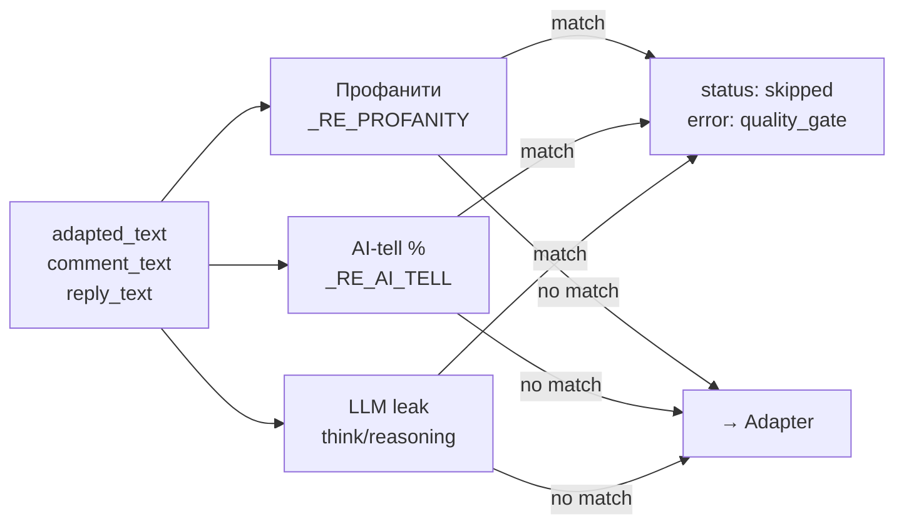
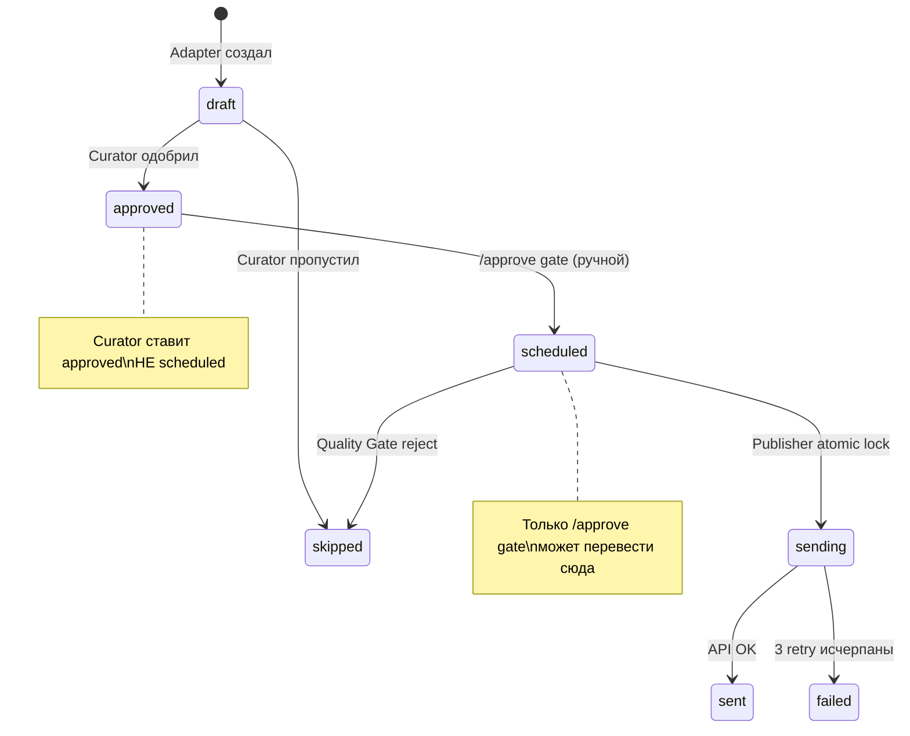

# Publisher — Публикатор

## Текущее состояние (v3 + Quality Gate) — обновлено 31 марта 2026

### Publisher v3 (n8n)
**n8n ID:** ErbbScuvxWHLX1np
**Cron:** */30 09:00-03:00 Istanbul (UTC+3)
**Статус:** ✅ Active (13 платформ)

7 нод:
```
Schedule → Select Scheduled → Has Post? → Call Publisher → Update Status → Dead Letter? → TG Alert
```

### Quality Gate (в Publisher Service)

**Добавлен:** 30 марта 2026 (combo-review: MiniMax 10/10 + Codex APPROVED)

Pre-flight проверка контента **перед** отправкой в адаптер. Три фильтра:



| Фильтр | Что ловит | Regex |
|--------|-----------|-------|
| Профанити | нахер, блядь, пизд*, еб*, мудак, дерьм*, говн* | `_RE_PROFANITY` (word-boundary aware) |
| AI-tell | NN% + AI/компаний/юзеров/проектов/агентов/людей/систем | `_RE_AI_TELL` (1-3 цифры + noun) |
| LLM leak | `<think>`, `<reasoning>` теги | string match |

**Проверяемые поля:** `adapted_text`, `comment_text`, `reply_text` — все три.

**Результат при reject:** `PublishResult(status="skipped")` → DB `status = 'skipped'`, `error = 'quality_gate: ...'`. Без retry.

### Cache-buster для картинок

Добавлен `?v={nanoseconds}` к image URL **только** для `corp.timzinin.com` (через `urlparse.hostname`). Не затрагивает подписанные/внешние URL.

**Причина:** nginx 302 redirect кешировался на стороне Telegram/Threads. Cache-buster обходит кеш.

### Python Publisher Service
**URL:** http://publisher-service:8085 (Docker internal)
**External port:** 127.0.0.1:8086 (localhost only, **NOT exposed to internet**)
**Source:** /opt/publisher-service/main.py
**Adapters:** /opt/auto-publisher/adapters/ (mounted read-only)
**Credentials:** /opt/zinin-corp/.env (env_file в docker-compose)
**Auth:** Нет HTTP-аутентификации. Доступ ограничен на уровне сети (127.0.0.1 binding + Docker bridge).

**Endpoints:**
| Method | Path | Input | Output | DB changes? |
|--------|------|-------|--------|-------------|
| POST | /publish | {platform_post_id} | {status, platform, post_id, external_id, error} | Yes (sending→sent/failed) |
| POST | /verify | {platform_post_id} | {status, platform, post_id, reason} | No |
| POST | /test-publish | — | HTTP 403 | **DISABLED** — published to real accounts |
| GET | /health | — | {status: "ok"} | No |

**Safe testing:** `/test-publish` **ОТКЛЮЧЁН** (HTTP 403). Публиковал в реальные аккаунты. Для тестирования — только local adapter testing.

### Allowlist (Phase 3 — 13 платформ)

**Primary filter:** SQL в n8n Publisher v3 workflow (Select Scheduled):
```sql
WHERE platform IN ('telegram','bluesky','threads_ru','threads_en','vk','facebook','mastodon','devto','hashnode','linkedin','writeas','minds','nostr')
```
Неразрешённые платформы **не попадают** в Publisher вообще. Нет HTTP вызова, нет retry, нет шума.

**Secondary guard:** `PUBLISH_ALLOWLIST` env var в Publisher Service. Если пост каким-то образом дошёл — 403 ROLLOUT GUARD.

**Где живёт allowlist:**
| Место | Что делает | Приоритет |
|-------|-----------|-----------|
| n8n Select Scheduled SQL | Фильтрует ДО HTTP вызова | Primary |
| Publisher Service env var | Reject если прошёл мимо SQL | Secondary |
| docs/Publisher.md | Документация | Reference |

**Расширение allowlist:** обновить **оба** места синхронно:
1. n8n workflow SQL: `platform IN (...)`
2. Contabo env: `PUBLISH_ALLOWLIST=...` + restart publisher-service

**Текущий allowlist (Phase 3):** telegram, bluesky, threads_ru, threads_en, vk, facebook, mastodon, devto, hashnode, linkedin, writeas, minds, nostr

**Anti-duplicate guard:** перед публикацией сервис атомарно ставит `status='sending'` через `UPDATE ... WHERE status IN ('scheduled','failed') RETURNING id`. Если пост уже `sent`, `verified`, `published` или `sending` — возвращает HTTP 400/409. Это предотвращает повторную публикацию при параллельных вызовах или ручном тестировании.

### Каноническая модель статусов (Sprint 3)



| Статус | Что означает | Кто ставит |
|--------|-------------|-----------|
| draft | Adapter создал | Adapter workflow |
| approved | Curator одобрил, ожидает ручного gate | Curator workflow |
| scheduled | Одобрен к публикации | `/approve` endpoint (ручной) |
| sending | Publisher atomic lock | Publisher Service |
| sent | Опубликован | Publisher Service |
| verified | Read-back подтвердил | /verify endpoint |
| failed | 3 retry исчерпаны | Publisher Service |
| skipped | Curator/Quality Gate отклонил | Curator / Quality Gate |
| published | Legacy (Publisher v2) | Deprecated |

### Scheduling Control endpoints

| Method | Path | Что делает |
|--------|------|-----------|
| POST | /approve | Переводит `approved` → `scheduled` (manual gate) |
| POST | /freeze | Emergency: `scheduled` → `draft` |
| GET | /queue | Показывает pending approved/scheduled/draft |

### Backlog dump protection

Curator больше **НЕ ставит `scheduled`** напрямую. Ставит `approved`. Publisher v3 видит только `scheduled` rows. Единственный путь в `scheduled` — через `/approve` endpoint. Это предотвращает автоматическую публикацию без ручного одобрения.

**Verify endpoint:** проверяет наличие поста на платформе по external_id.

| Платформа | Метод verify | Надёжность |
|-----------|-------------|------------|
| Telegram | Trusted (sendMessage response) | Высокая — Тим подтвердил внешне |
| Dev.to | API GET /articles/{id} | Высокая — проверяет реальную статью |
| VK | API wall.getById | Высокая — проверяет реальный пост |
| Threads RU | Graph API GET /{id} | Высокая — проверяет реальный пост |
| Hashnode | Trusted (GraphQL response) | Средняя — доверяем API ответу |
| Bluesky | Trusted (createRecord response) | Средняя — доверяем API ответу |

### Deactivated
- **Publisher v2** (1cD3qXs2XZkgcQyt) — ДЕАКТИВИРОВАН 22 мар 2026. Был причиной дубликатов и публикаций без картинок.

### Текущий статус публикации (Phase 3)

> **ТЕКУЩЕЕ СОСТОЯНИЕ (31 марта 2026):**
> - Publisher v3 **АКТИВЕН** (quality gate включён)
> - 15 draft rows ожидают scheduling
> - Row 393 (telegram, post 41) — skipped (AI-tell + HTTP 400)
> - Публикация идёт только для rows со статусом `scheduled`
> - E2E verified: post 471 → TG msg_id=318 (quality gate PASS)

**Allowlist (когда Publisher активен):** 13 платформ — telegram, bluesky, threads_ru, threads_en, vk, facebook, mastodon, devto, hashnode, linkedin, writeas, minds, nostr

**Статус платформ:**
| Платформа | Статус | Примечание |
|-----------|--------|-----------|
| telegram | ✅ Работает | Quality Gate active |
| threads_ru | ✅ Работает | 2-step API |
| threads_en | ✅ Работает | Через Publer |
| bluesky | ✅ Работает | Image auto-resize >950KB |
| vk | ✅ Работает | wall.post |
| facebook | ✅ Работает | Через Publer |
| linkedin | ✅ Работает | Direct adapter |
| devto | ✅ Работает | Long-form |
| hashnode | ✅ Работает | GraphQL |
| writeas | ✅ Работает | |
| minds | ✅ Работает | |
| nostr | ✅ Работает | |
| mastodon | ✅ Работает | Image support |

Все платформы проходят через Quality Gate перед публикацией.

### Historically Verified Capability (через Python Service)

| Платформа | Статус | External ID | Примечание |
|-----------|--------|-------------|-----------|
| Telegram | ✅ sent | 292, 293 | Верифицировано внешне (Тим видел в канале) |
| Dev.to | ✅ sent | 3384773 | Статья опубликована |
| VK | ✅ sent (text+image) | 351 | wall.post в сообщество (group 229813427). Target = community wall |
| Threads RU | ✅ sent | 17992609448939339 | Двухшаговый API (create+publish) |
| Hashnode | ✅ sent | 69c0062180048b76fe51c505 | GraphQL mutation |
| Bluesky | ⚠️ text verified (5/5) | at://... | Text ok, image blocked (>1MB blob limit) |
| Facebook | ✅ sent (text+image) | Publer job_id | Personal profile через Publer. 2-step media upload. Verified by Tim |
| Threads EN | ✅ sent (text+image) | threads.com/@timzinin_en/... | Через Publer. 2-step media upload. Verified by Tim |
| Write.as | ✅ sent | 9kmx5xof89omds5g | Historically verified during manual tests 22 mar |
| Minds | ✅ sent | 1882500900157657088 | Historically verified during manual tests 22 mar |
| Nostr | ✅ sent | 92928e1a... | Historically verified during manual tests 22 mar |
| Tumblr | ❌ blocked | — | 401 OAuth expired. Adapter rewritten, credential needs refresh |
| Mastodon | ❌ blocked | — | 401 token invalid |
| LinkedIn | ✅ sent | — | В Publisher v3 через адаптер linkedin.py. Ранее был отдельный pipeline |

---

## Инцидент: дубликаты (22 мар 2026)

**Что произошло:** Telegram и LinkedIn получили дублированные посты Zeroboot.

**Root cause:** До внедрения anti-duplicate guard, ручной `curl POST /publish` ставил `sending` но при ошибке не переводил в `sent/failed` (это делает n8n Update Status нода). Пост оставался `scheduled` в БД, и publisher workflow отправлял его повторно. После fix: Publisher Service атомарно ставит `sending` перед публикацией — повторный вызов по тому же посту возвращает 409.

**Что сделано:**
- Publisher v2 деактивирован
- Publisher v3 обновляет статус на `sent` сразу после успешного вызова

**Anti-duplicate measures:**

Риск дублей значительно снижен, но не исключён полностью. Root cause известен.

Текущие меры:
1. Anti-duplicate guard: atomic `sending` lock в Publisher Service (HTTP 400/409 при повторном вызове)
2. Процессное правило: ручной `curl POST /publish` по prod scheduled постам запрещён
3. Тестирование: создавать отдельный тестовый пост с уникальным текстом

Safe testing:
- **`POST /test-publish` — DISABLED** (HTTP 403). Публиковал в реальные аккаунты. Инцидент 22 мар.
- Для тестирования платформ — только local adapter testing вне Docker.

Инцидент 22 мар: дубли в TG, LinkedIn, VK — все от одной причины (ручной curl без обновления статуса).

---

## Sprint 4B: Verification + остальные платформы

| # | Задача | Описание |
|---|--------|----------|
| PUB-B1 | Bluesky fix | Исправить адаптер (encoding апострофов) |
| PUB-B2 | verified status | External read-back для TG, Dev.to, VK, Threads RU, Hashnode |
| PUB-B3 | Publer platforms | Facebook, Threads EN через Publer API |
| PUB-B4 | LinkedIn | OAuth refresh + image upload |
| PUB-B5 | Mastodon | Восстановить credential |
| PUB-B6 | Observer Publication Log | Показывать sent/verified/failed с деталями |
| PUB-B7 | Новые 4 платформы | Tumblr, Write.as, Minds, Nostr через адаптеры |
