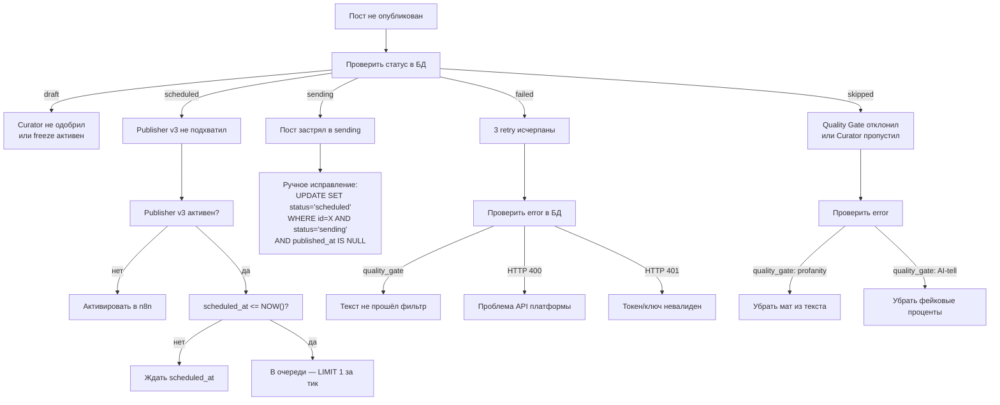

# Runbook — диагностика и восстановление

> Операционные процедуры для content pipeline. Обновлено 31 марта 2026.

## Почему пост не вышел?



## Команды диагностики

### Статус поста
```sql
SELECT id, platform, status, error, retries, post_external_id
FROM content.platform_posts WHERE id = <ID>;
```

### Все scheduled сейчас
```sql
SELECT id, platform, scheduled_at FROM content.platform_posts
WHERE status = 'scheduled' ORDER BY scheduled_at;
```

### Publisher v3 статус
```sql
SELECT active FROM workflow_entity WHERE id = 'ErbbScuvxWHLX1np';
```

### Последние ошибки
```bash
docker logs publisher-service --tail 50 2>&1 | grep -E "ERROR|FAIL|WARNING"
```

## Восстановление

### Пост застрял в `sending`
```sql
-- Проверить что пост не опубликован (нет external_id)
SELECT id, post_external_id FROM content.platform_posts
WHERE id = <ID> AND status = 'sending';

-- Если external_id пуст — вернуть в scheduled
UPDATE content.platform_posts SET status = 'scheduled'
WHERE id = <ID> AND status = 'sending' AND post_external_id IS NULL;
```

### Emergency freeze (остановить все публикации)
```sql
UPDATE content.platform_posts SET status = 'draft'
WHERE status = 'scheduled';
```
Также: деактивировать Publisher v3 в n8n.

### Откат publisher-service
```bash
# На Contabo:
docker cp /opt/publisher-service/main.py.bak publisher-service:/app/main.py
docker restart publisher-service
```

### Replay одного поста
```sql
UPDATE content.platform_posts
SET status = 'scheduled', retries = 0, error = NULL,
    scheduled_at = NOW() + INTERVAL '10 minutes'
WHERE id = <ID>;
```
**ВАЖНО:** Publisher v3 должен быть активен. Quality Gate проверит текст автоматически.

## Мониторинг

### Текущее состояние pipeline
```sql
SELECT status, count(*) FROM content.platform_posts GROUP BY status ORDER BY status;
```

### Посты без картинок (image-post без image_url)
```sql
SELECT id, platform FROM content.platform_posts
WHERE include_image = true AND image_url IS NULL AND status NOT IN ('skipped');
```

## Известные инциденты

### 30 марта 2026
- 4 debug сообщения отправлены в @timofeyzinin канал (Claude тестировал quality gate через production channel)
- Post 51 ("нахер") опубликован — quality gate был в неправильном файле контейнера
- Post 458 опубликован normal pipeline (freeze не учёл новые scheduled rows)

### 31 марта 2026
- Post 471 (post 45, telegram) опубликован cron — Curator перезаписал freeze (draft → scheduled)
- Publisher v3 деактивирован для предотвращения дальнейших незапланированных публикаций
- 18 rows заморожены в draft

### Row 393 (telegram, post 41)
- Статус: draft (заморожен)
- Ошибка: HTTP 400 через /publish endpoint, но работает через прямой API вызов
- Причина: не определена
- Рекомендация: пересоздать пост с чистым текстом (убрать "97%")
