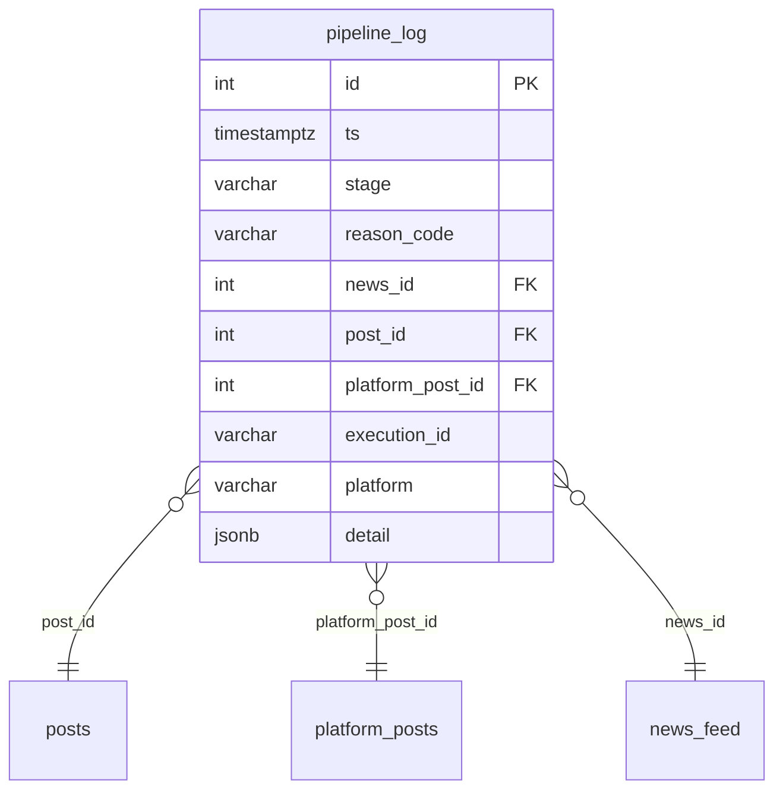
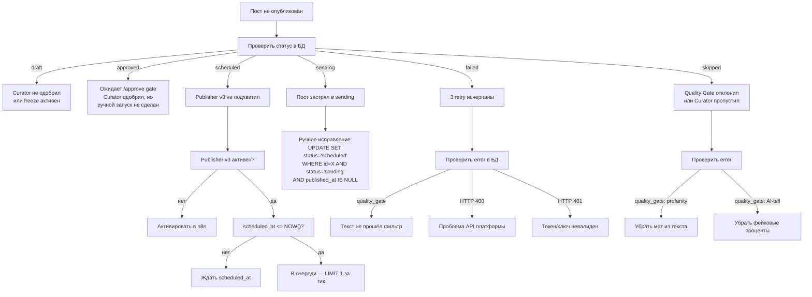
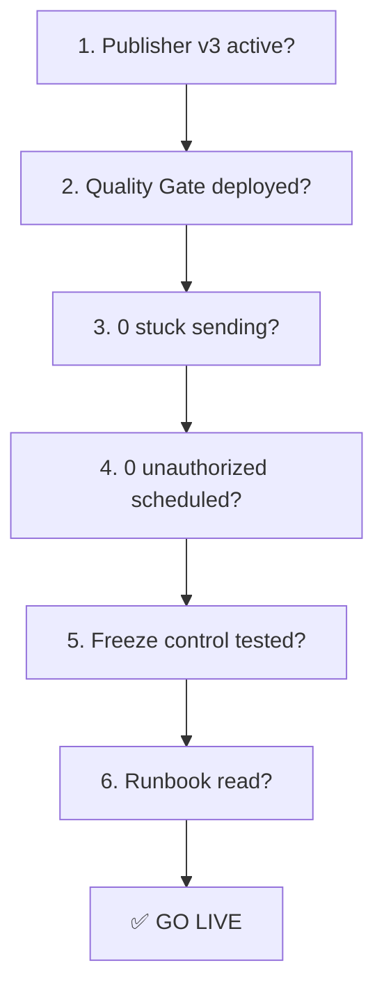

# Runbook — диагностика и восстановление

> Операционные процедуры для content pipeline. Обновлено 31 марта 2026.

## Structured Logging (Sprint 2)

### Таблица content.pipeline_log



### Correlation keys

| Key | Назначение | Пример |
|-----|-----------|--------|
| news_id | Источник новости | 304 |
| post_id | Мастер-контент | 47 |
| platform_post_id | Платформенный вариант | 577 |
| execution_id | n8n execution | 696 |

### Reason codes

| Stage | Code | Значение |
|-------|------|---------|
| scout | SCOUT_OK | Разведка завершена |
| scout | SCOUT_DNS_FAIL | DNS ошибка |
| writer | WRITER_OK | Пост создан |
| writer | WRITER_DNS_FAIL | MiniMax DNS ошибка |
| writer | WRITER_LOW_SCORE | Низкий quality score |
| adapter | ADAPTER_OK | Адаптация завершена |
| adapter | ADAPTER_DNS_FAIL | MiniMax DNS ошибка |
| illustrator | ILLUST_OK | Картинка сгенерирована |
| illustrator | ILLUST_NO_POST | Нет постов для иллюстрации |
| curator | CURATOR_OK | Распределение завершено |
| quality_gate | QG_PROFANITY | Мат обнаружен |
| quality_gate | QG_AI_TELL | AI-tell проценты |
| quality_gate | QG_LLM_LEAK | LLM reasoning leak |
| publisher | PUB_START | Публикация начата |
| publisher | PUB_OK | Опубликовано |
| publisher | PUB_SKIPPED | Quality gate отклонил |
| publisher | PUB_HTTP_ERR | Ошибка API платформы |
| publisher | PUB_DB_FAIL | DB update failed |

### Трассировка одного поста

```sql
-- 1. Найти путь поста по platform_post_id
SELECT pp.id, pp.post_id, pp.platform, pp.status, pp.error,
       p.news_id, p.quality_score, nf.title as news_title
FROM content.platform_posts pp
JOIN content.posts p ON p.id = pp.post_id
LEFT JOIN content.news_feed nf ON nf.id = p.news_id
WHERE pp.id = <platform_post_id>;

-- 2. Все события в pipeline_log
SELECT ts, stage, reason_code, platform, detail
FROM content.pipeline_log
WHERE post_id = <post_id>
   OR platform_post_id = <platform_post_id>
ORDER BY ts;

-- 3. Последние ошибки
SELECT ts, stage, reason_code, post_id, platform, detail
FROM content.pipeline_log
WHERE reason_code NOT LIKE '%_OK'
ORDER BY ts DESC LIMIT 20;
```

## Почему пост не вышел?



## Scheduling Control (Sprint 3)

### Каноническая модель
```
draft → approved (Curator) → scheduled (/approve) → sent (Publisher)
```

### Просмотр очереди
```bash
curl -s http://127.0.0.1:8086/queue | python3 -m json.tool
```

### Одобрить публикацию (approved → scheduled)
```bash
curl -s -X POST http://127.0.0.1:8086/approve | python3 -m json.tool
```

### Emergency freeze (scheduled → draft)
```bash
curl -s -X POST http://127.0.0.1:8086/freeze | python3 -m json.tool
```

### Все approved (ожидают /approve)
```sql
SELECT id, post_id, platform, scheduled_at
FROM content.platform_posts WHERE status = 'approved'
ORDER BY scheduled_at;
```

## Команды диагностики

### Статус поста
```sql
SELECT id, platform, status, error, retries, post_external_id
FROM content.platform_posts WHERE id = <ID>;
```

### Все scheduled сейчас
```sql
SELECT id, platform, scheduled_at FROM content.platform_posts
WHERE status = 'scheduled' ORDER BY scheduled_at;
```

### Publisher v3 статус
```sql
SELECT active FROM workflow_entity WHERE id = 'ErbbScuvxWHLX1np';
```

### Последние ошибки
```bash
docker logs publisher-service --tail 50 2>&1 | grep -E "ERROR|FAIL|WARNING"
```

## Восстановление

### Пост застрял в `sending`
```sql
-- Проверить что пост не опубликован (нет external_id)
SELECT id, post_external_id FROM content.platform_posts
WHERE id = <ID> AND status = 'sending';

-- Если external_id пуст — вернуть в scheduled
UPDATE content.platform_posts SET status = 'scheduled'
WHERE id = <ID> AND status = 'sending' AND post_external_id IS NULL;
```

### Emergency freeze (остановить все публикации)
```sql
UPDATE content.platform_posts SET status = 'draft'
WHERE status = 'scheduled';
```
Также: деактивировать Publisher v3 в n8n.

### Откат publisher-service
```bash
# На Contabo:
docker cp /opt/publisher-service/main.py.bak publisher-service:/app/main.py
docker restart publisher-service
```

### Replay одного поста
```sql
UPDATE content.platform_posts
SET status = 'scheduled', retries = 0, error = NULL,
    scheduled_at = NOW() + INTERVAL '10 minutes'
WHERE id = <ID>;
```
**ВАЖНО:** Publisher v3 должен быть активен. Quality Gate проверит текст автоматически.

## Мониторинг

### Текущее состояние pipeline
```sql
SELECT status, count(*) FROM content.platform_posts GROUP BY status ORDER BY status;
```

### Посты без картинок (image-post без image_url)
```sql
SELECT id, platform FROM content.platform_posts
WHERE include_image = true AND image_url IS NULL AND status NOT IN ('skipped');
```

## Известные инциденты

### 30 марта 2026
- 4 debug сообщения отправлены в @timofeyzinin канал (Claude тестировал quality gate через production channel)
- Post 51 ("нахер") опубликован — quality gate был в неправильном файле контейнера
- Post 458 опубликован normal pipeline (freeze не учёл новые scheduled rows)

### 31 марта 2026
- Post 471 (post 45, telegram) опубликован cron — Curator перезаписал freeze (draft → scheduled)
- Publisher v3 деактивирован для предотвращения дальнейших незапланированных публикаций
- 18 rows заморожены в draft

### Row 393 (telegram, post 41)
- Статус: **skipped** (закрыт)
- Ошибка: HTTP 400 через /publish endpoint + AI-tell "97%"
- Решение: помечен как skipped, не будет повторяться

## Go-live чеклист

> Перед активацией Publisher v3 — проверить все пункты.



| # | Критерий | Команда проверки | Ожидаемый результат |
|---|----------|-----------------|-------------------|
| 1 | Publisher v3 active | `SELECT active FROM workflow_entity WHERE id='ErbbScuvxWHLX1np'` | `true` |
| 2 | Quality Gate deployed | `docker exec publisher-service grep _quality_gate /app/main.py` | found |
| 3 | 0 stuck sending | `SELECT count(*) FROM content.platform_posts WHERE status='sending'` | 0 |
| 4 | Scheduled rows = expected | `SELECT count(*) FROM content.platform_posts WHERE status='scheduled'` | known count |
| 5 | Freeze works | Set 1 row to draft → verify Curator does NOT revert (Publisher v3 off) | stays draft |
| 6 | Image serving OK | `curl -sI https://corp.timzinin.com/content-images/post_45_*.png` | HTTP 200 |
| 7 | No profanity in queue | Run QG audit on all draft/scheduled rows | 0 dirty |
| 8 | Tim approved content | Показать тексты Тиму через TG | OK received |
