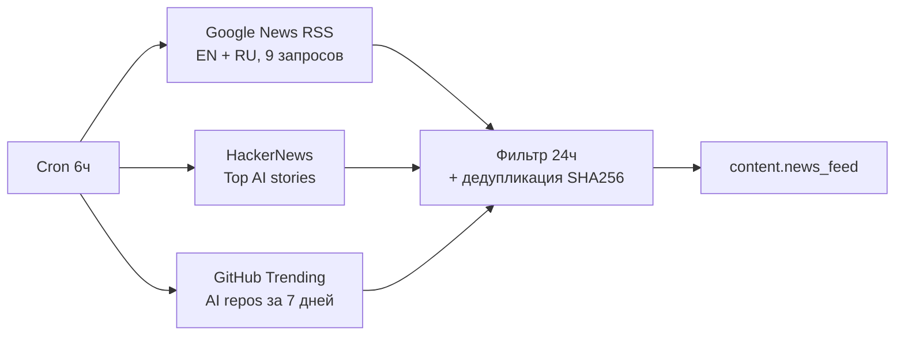
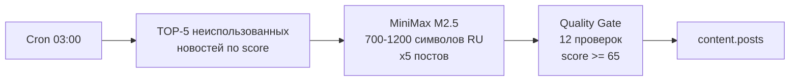
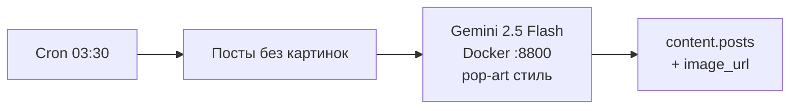
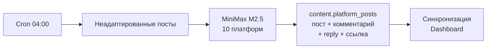
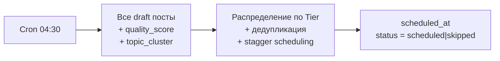
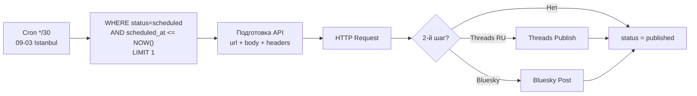
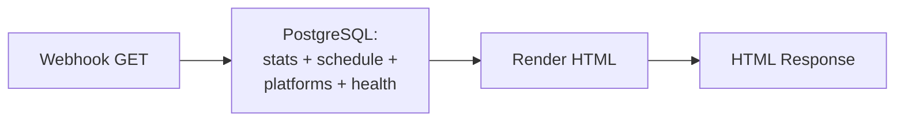

# Workflows (n8n)

> Все workflows на Contabo VPS 30, n8n.timzinin.com

## Активные workflows

| # | Workflow | n8n ID | Cron | Статус |
|---|---------|--------|------|--------|
| 1 | Scout — Разведка | RSQALdJch4WYZfit | каждые 6ч (05:00 Istanbul) | ✅ Active |
| 2 | Writer — Автор | ZQtg31g6dzAV0lXX | 06:00 Istanbul | ✅ Active |
| 3 | Illustrator — Художник | Z94O5uyaFEmrYGIJ | 06:30 Istanbul | ✅ Active |
| 4 | Adapter — Адаптер | NJoPcdp38ZU0dQwG | 07:00 Istanbul | ✅ Active |
| 5 | Curator — Куратор | EYPcT5B4rLmQRQBM | 07:30 Istanbul | ✅ Active |
| 6 | Publisher v2 — Публикатор | 1cD3qXs2XZkgcQyt | */30 09:00-00:00 Istanbul | ⚠️ Partial |
| 7 | Dashboard — Дашборд | DC3a34HOedbU7rVb | webhook | ✅ Active |
| 8 | Curator Preview | JzYcKrUfXheatEi1 | webhook | ✅ Active |
| 9 | Observer — Наблюдатель | V2wnna7ACw5iSqdi | webhook | ✅ Active |

## Деактивированные

| Workflow | n8n ID | Причина |
|---------|--------|---------|
| LinkedIn Pipeline v3 | umId4uV39dewR8Um | Заменён Publisher v2 |
| Threads News | JHZEnMf87VLN93pI | Заменён Publisher v2 |

## Кнопочные workflows (ручной запуск)

| Workflow | n8n ID | Назначение |
|---------|--------|-----------|
| Запуск Scout | UR2KDwBOocF82mZ1 | Ручной запуск Scout |
| Запуск Writer | rejq5CSnMMqdt4Wz | Ручной запуск Writer |
| Запуск Illustrator | JLrN4a1uAuHEhdoH | Ручной запуск Illustrator |
| Запуск Adapter | RjCOikDrkV6JEL0E | Ручной запуск Adapter |

---

## 1. Scout — Разведка

**Источники:** Google News RSS (EN + RU, 9 AI-запросов), HackerNews Top Stories, GitHub Trending AI repos
**Фильтрация:** только за последние 24ч, дедупликация по SHA256(title)
**Результат:** записи в `content.news_feed` с полями title, url, source, score

---

## 2. Writer — Автор

**LLM:** MiniMax M2.5 через Anthropic-совместимый API
**Промпт:** Anti-AI writing rules (запрет тире, канцелярита, "это не просто")
**Quality Gate:** 12 проверок, минимальный score 65
**Результат:** 3-5 постов/день в `content.posts`

---

## 3. Illustrator — Художник

**Сервис:** Docker контейнер `gemini-image-service` (порт 8800, внутри Docker network)
**Стиль:** Pop-art (красный/жёлтый, halftone, fisheye perspective, девушки каждый 3-й пост)
**Хранение:** /opt/content-pipeline-images/ → corp.timzinin.com/content-images/

---

## 4. Adapter — Адаптер

**10 платформ:** telegram, linkedin, threads_ru, threads_en, vk, bluesky, facebook, mastodon, devto, hashnode
**Составные сущности:** post_text + comment_text (LI/FB) + reply_text (Threads) + link_url + include_image
**Результат:** ~50 записей/день в `content.platform_posts` со статусом `draft`

---

## 5. Curator — Куратор

**Tier-система:** см. [[Curator]]
**Дедупликация:** topic_cluster за последние 3 дня — fresh посты приоритетнее stale
**Scheduling:** Istanbul UTC+3, stagger по платформам
**Результат:** ~14-25 записей `scheduled`, остальные `skipped`

---

## 6. Publisher v2 — Публикатор

**Текущий статус:** 2 платформы верифицированы (TG, Dev.to), 8 не верифицированы или сломаны
**Текущая модель:** `scheduled → published` (UPDATE без внешней проверки)
**Sprint 4:** рефакторинг через Python HTTP сервис + новая модель `scheduled → sent → verified/failed`

---

## 7. Dashboard

**URL:** GET https://n8n.timzinin.com/webhook/content-dashboard
**Данные:** news_feed, posts, platform_posts, stats (scheduled, skipped, published)
**Формат:** HTML с таблицами и статистикой

## 8. Curator Preview

**URL:** GET https://n8n.timzinin.com/webhook/curator-preview
**Назначение:** dry-run Curator без изменения БД. Показывает snapshot текущих draft → что бы Curator назначил, НЕ меняя данные.
**Важно:** preview пустой если нет draft постов (все уже scheduled/skipped). Это не баг.
**Формат:** JSON с полями scheduled[], skipped[], summary

---

## 9. Observer — Наблюдатель

**n8n ID:** V2wnna7ACw5iSqdi
**URL:** GET https://n8n.timzinin.com/webhook/observer
**Timezone:** Istanbul (UTC+3)

Центральный operational dashboard. Показывает:

| Секция | Что показывает |
|--------|---------------|
| Cards | Draft / Scheduled / Published / Skipped / Failed / Posts / News |
| Pipeline Health | Последний запуск каждого workflow за 24ч, количество записей |
| Platform Summary | Таблица: платформа × статус (draft/scheduled/published/skipped/failed) |
| Schedule | Расписание постов с временем (Istanbul), quality score, topic cluster |
| Recent Published | Последние 10 опубликованных постов |

**Ссылки на Observer:**
- corp.timzinin.com → sidebar → Observer (PIPELINE)
- corp.timzinin.com/content-calendar.html → подзаголовок
- TG сводка от Curator (ежедневно 07:30 Istanbul)
